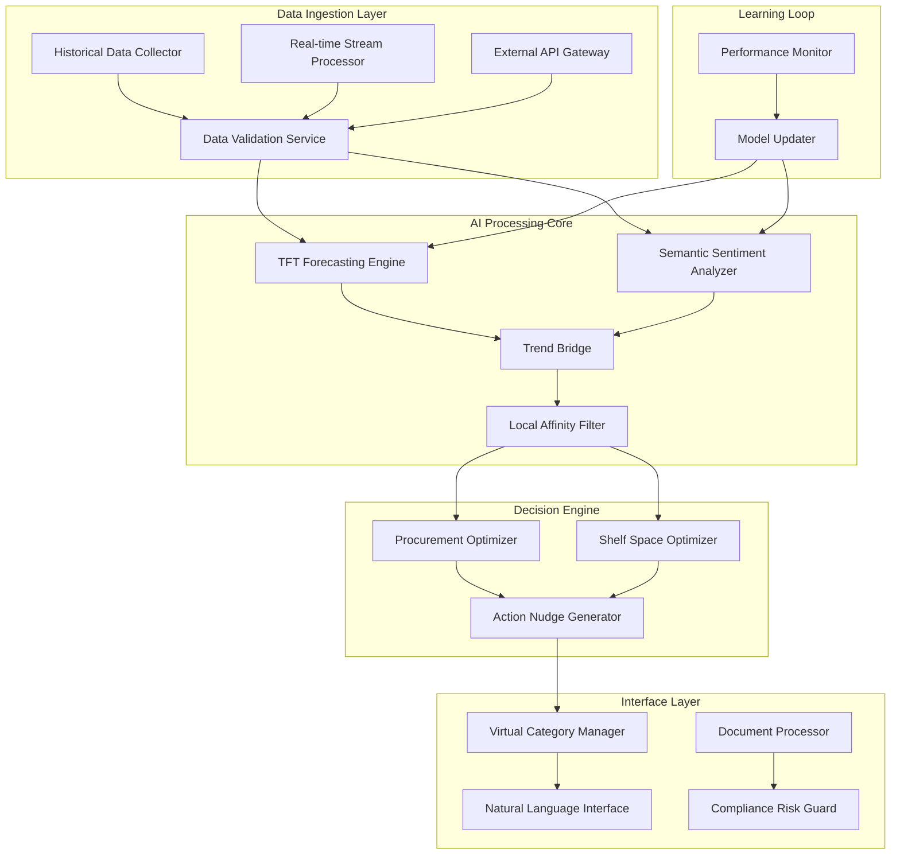
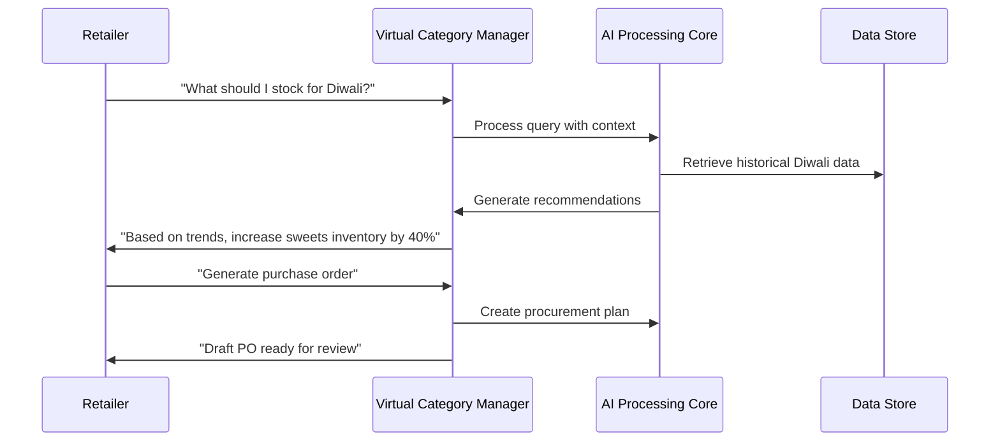

# Design Document: Meridian Commerce Engine

## Overview

The Meridian Commerce Engine is a sophisticated AI-powered system that transforms traditional retail inventory management through anticipatory commerce. The system combines advanced machine learning techniques, real-time data processing, and natural language interfaces to provide retailers with predictive insights and automated procurement capabilities.

The engine addresses the core challenge of disconnected supply chains in Indian retail markets by creating a unified platform that processes multiple data streams - from historical sales patterns to real-time social media trends - and generates actionable intelligence for inventory optimization.

## Architecture

The system follows a microservices architecture with clear separation of concerns, enabling scalability and maintainability across diverse retail environments.



### Core Components

**Data Processing Tier:**
- Historical Static Layer: Processes transaction history, store attributes, and demographic data
- Dynamic Local Layer: Handles real-time environmental data including weather, festivals, and transit
- External Integration Hub: Manages connections to social media APIs, economic indicators, and supplier systems

**AI Intelligence Tier:**
- TFT Core: Temporal Fusion Transformer for probabilistic demand forecasting
- Semantic Sentiment Analyzer: Multi-modal analysis of global trends and social signals
- Trend Bridge: Converts global insights into local market predictions
- Local Affinity Filter: Applies regional cultural and demographic adjustments

**Decision Support Tier:**
- Procurement Optimizer: Automated purchase order generation and supplier selection
- Shelf Space Optimizer: Inventory placement and merchandising recommendations
- Action Nudge Generator: Contextual recommendations with confidence scoring

**Interface Tier:**
- Virtual Category Manager: Natural language copilot for retailer interactions
- Document Processor: Invoice and logistics document understanding
- Compliance Risk Guard: Automated compliance checking and audit trail management

## Components and Interfaces

### TFT Forecasting Engine

The Temporal Fusion Transformer serves as the core predictive engine, implementing a state-of-the-art architecture for time series forecasting with interpretability.

**Input Interface:**
```python
class ForecastInput:
    historical_sales: TimeSeries
    store_attributes: StoreProfile
    environmental_factors: EnvironmentalData
    trend_signals: TrendVector
    forecast_horizon: int  # days
    confidence_level: float  # 0.95 for 95% confidence
```

**Output Interface:**
```python
class ProbabilisticForecast:
    point_forecast: TimeSeries
    confidence_intervals: ConfidenceInterval
    scenarios: Dict[str, TimeSeries]  # best, worst, most_likely
    feature_importance: Dict[str, float]
    uncertainty_quantification: UncertaintyMetrics
```

**Key Capabilities:**
- Multi-horizon forecasting (1-30 days)
- Attention mechanisms for feature importance
- Quantile regression for uncertainty estimation
- Automatic hyperparameter optimization

### Semantic Sentiment Analyzer

Processes unstructured data from social media, news, and economic indicators to extract actionable trend signals.

**Processing Pipeline:**
1. **Data Collection:** Multi-source ingestion from Twitter, Instagram, news feeds, economic APIs
2. **Text Processing:** Multilingual NLP with Hindi, English, and regional language support
3. **Sentiment Extraction:** Aspect-based sentiment analysis for product categories
4. **Trend Vectorization:** Conversion of textual insights into numerical feature vectors
5. **Temporal Alignment:** Synchronization of trend signals with sales data timestamps

**Output Format:**
```python
class TrendVector:
    category_sentiment: Dict[str, float]  # -1 to 1 sentiment score
    trend_momentum: float  # rate of change
    geographic_scope: List[str]  # affected regions
    confidence_score: float  # prediction confidence
    source_attribution: Dict[str, float]  # source reliability weights
```

### Trend Bridge

Converts global trend signals into local market predictions through sophisticated correlation analysis and cultural adaptation.

**Correlation Engine:**
- Historical trend-to-sales correlation analysis
- Regional cultural preference modeling
- Demographic-based trend filtering
- Seasonal adjustment algorithms

**Local Affinity Filter:**
- Cultural preference scoring based on regional demographics
- Festival and event calendar integration
- Local competitor analysis and market positioning
- Price sensitivity modeling for different regions

### Virtual Category Manager

Natural language interface that provides conversational access to all system capabilities.

**Conversation Flow:**


**Natural Language Understanding:**
- Intent classification for inventory queries
- Entity extraction for products, timeframes, and locations
- Context maintenance across conversation sessions
- Multi-turn dialogue management

### Procurement Optimizer

Automated system for generating and managing purchase orders based on demand predictions.

**Optimization Algorithm:**
- Multi-objective optimization balancing cost, risk, and service level
- Supplier reliability scoring and selection
- Lead time optimization with buffer calculations
- Budget constraint handling and cash flow optimization

**Decision Factors:**
```python
class ProcurementDecision:
    demand_forecast: ProbabilisticForecast
    current_inventory: InventoryLevel
    supplier_options: List[SupplierProfile]
    budget_constraints: BudgetLimits
    risk_tolerance: RiskProfile
    
    def optimize(self) -> PurchaseOrder:
        # Multi-objective optimization logic
        pass
```

## Data Models

### Core Data Structures

**Store Profile:**
```python
class StoreProfile:
    store_id: str
    location: GeoLocation
    size_category: str  # small, medium, large
    customer_demographics: Demographics
    historical_performance: PerformanceMetrics
    local_preferences: PreferenceProfile
```

**Product Catalog:**
```python
class Product:
    product_id: str
    category: str
    subcategory: str
    brand: str
    price_range: PriceRange
    seasonality_profile: SeasonalityData
    trend_sensitivity: float
```

**Transaction Record:**
```python
class Transaction:
    transaction_id: str
    store_id: str
    product_id: str
    quantity: int
    price: float
    timestamp: datetime
    customer_segment: str
    payment_method: str
```

**Environmental Context:**
```python
class EnvironmentalData:
    weather: WeatherData
    festivals: List[Festival]
    transit_disruptions: List[Disruption]
    economic_indicators: EconomicData
    social_events: List[SocialEvent]
```

### Data Flow Architecture

**Batch Processing Pipeline:**
1. **Daily ETL:** Historical sales data, store updates, product catalog changes
2. **Weekly Analysis:** Trend correlation updates, model retraining triggers
3. **Monthly Optimization:** Supplier performance review, regional preference updates

**Real-time Processing Pipeline:**
1. **Stream Ingestion:** Weather updates, social media feeds, transit alerts
2. **Event Processing:** Festival notifications, economic indicator changes
3. **Immediate Response:** Forecast updates, alert generation, recommendation refresh

**Data Storage Strategy:**
- **Time Series Database:** Sales transactions, environmental data, forecast results
- **Graph Database:** Product relationships, supplier networks, customer segments
- **Document Store:** Unstructured data from social media, news, documents
- **Cache Layer:** Frequently accessed forecasts, real-time recommendations

## Correctness Properties

*A property is a characteristic or behavior that should hold true across all valid executions of a system—essentially, a formal statement about what the system should do. Properties serve as the bridge between human-readable specifications and machine-verifiable correctness guarantees.*

Before defining the correctness properties, let me analyze the acceptance criteria to determine which ones are testable through property-based testing.

<function_calls>
<invoke name="prework">
<parameter name="featureName">meridian-commerce-engine

### Property Reflection

After analyzing all acceptance criteria, I identified several areas where properties can be consolidated to eliminate redundancy:

**Consolidation Opportunities:**
- Properties 2.1 and 2.2 (trend extraction and conversion) can be combined into a comprehensive trend processing property
- Properties 4.2, 4.3, and 4.4 (procurement factors) can be unified into a single procurement optimization property
- Properties 5.1, 5.2, and 5.5 (document processing) can be combined into a comprehensive document handling property
- Properties 7.2, 7.3, and 7.4 (learning behaviors) can be consolidated into a unified learning loop property

This consolidation ensures each property provides unique validation value while maintaining comprehensive coverage.

### Core Correctness Properties

**Property 1: Forecast Structure Completeness**
*For any* valid historical data and store attributes, the TFT_Core should generate forecasts containing 95% confidence intervals and three scenarios (best-case, worst-case, most-likely) where worst-case ≤ most-likely ≤ best-case
**Validates: Requirements 1.1, 1.3**

**Property 2: Environmental Data Influence**
*For any* environmental data input, forecasts generated with environmental data should differ measurably from forecasts without environmental data for the same base inputs
**Validates: Requirements 1.2**

**Property 3: Comprehensive Trend Processing**
*For any* valid social media or economic data, the Semantic_Sentiment_Analyzer should extract trend vectors with sentiment scores in [-1, 1] range, and the Trend_Bridge should convert these into numerical representations with correlation scores for all product categories
**Validates: Requirements 2.1, 2.2, 2.4**

**Property 4: Demographic Trend Adjustment**
*For any* global trend and regional demographic data, the Local_Affinity_Filter should produce different trend adjustments for different demographic profiles
**Validates: Requirements 2.3**

**Property 5: Source Weighting Consistency**
*For any* conflicting data sources with different historical accuracy weights, the final sentiment analysis should be more influenced by sources with higher accuracy weights
**Validates: Requirements 2.5**

**Property 6: Recommendation Structure Completeness**
*For any* demand spike prediction or optimization request, generated recommendations should include specific quantities, timing information, confidence levels, and risk assessments within valid ranges
**Validates: Requirements 3.2, 3.3, 3.4**

**Property 7: Learning Adaptation**
*For any* retailer feedback indicating correction direction, subsequent recommendations should change in the indicated direction
**Validates: Requirements 3.5**

**Property 8: Comprehensive Procurement Optimization**
*For any* high-confidence demand spike, the Procurement_Optimizer should generate purchase orders that incorporate current inventory levels, lead times, supplier capacity, and include quantity bounds (min ≤ recommended ≤ max)
**Validates: Requirements 4.1, 4.2, 4.4**

**Property 9: Supplier Selection Optimization**
*For any* procurement scenario with multiple suppliers, the selected supplier should optimize the combination of cost, reliability, and delivery time according to defined criteria
**Validates: Requirements 4.3**

**Property 10: Market Condition Responsiveness**
*For any* change in market conditions, pending purchase orders should be updated to reflect the new conditions before retailer approval
**Validates: Requirements 4.5**

**Property 11: Comprehensive Document Processing**
*For any* valid document (invoice, logistics document) in supported formats (PDF, image, structured data), the Compliance_Risk_Guard should extract all required information fields and create appropriate audit trail records
**Validates: Requirements 5.1, 5.4, 5.5**

**Property 12: Document Validation Accuracy**
*For any* logistics document and corresponding purchase order, validation should correctly identify matches and mismatches between shipment details and order specifications
**Validates: Requirements 5.2**

**Property 13: Anomaly Detection Reliability**
*For any* document with introduced anomalies, the Compliance_Risk_Guard should detect and flag the anomalies with appropriate corrective action suggestions
**Validates: Requirements 5.3**

**Property 14: Error Handling Resilience**
*For any* data quality issue or API failure, the system should log appropriate errors, implement fallback mechanisms, and continue processing with available data
**Validates: Requirements 6.3, 6.4**

**Property 15: Unified Learning Loop**
*For any* prediction-actual data pair, the system should calculate accuracy metrics, adjust model weights when errors are identified, validate improvements before deployment, and rollback if performance degrades
**Validates: Requirements 7.1, 7.2, 7.4, 7.5**

**Property 16: Automatic Retraining Triggers**
*For any* detected pattern change above threshold, the system should automatically initiate retraining of relevant model components
**Validates: Requirements 7.3**

**Property 17: Resource Provisioning Logic**
*For any* new retailer with specified store size and transaction volume, the system should provision resources proportional to the retailer's profile characteristics
**Validates: Requirements 8.1**

**Property 18: Localization Adaptation**
*For any* regional setting (language, currency, business practice), the system should adapt outputs appropriately to match local requirements
**Validates: Requirements 8.3**

**Property 19: Offline Operation Capability**
*For any* network connectivity limitation, the system should continue core operations in offline mode and synchronize when connectivity is restored
**Validates: Requirements 8.4**

**Property 20: Dynamic Resource Optimization**
*For any* change in usage patterns, the system should adjust resource allocation to optimize costs while maintaining performance requirements
**Validates: Requirements 8.5**

## Error Handling

### Graceful Degradation Strategy

**Data Source Failures:**
- Primary data source unavailable → Switch to secondary sources with quality indicators
- Partial data corruption → Process available data with confidence adjustments
- Complete data loss → Use cached forecasts with staleness warnings

**Model Performance Issues:**
- Accuracy degradation → Automatic rollback to previous stable version
- Training failures → Maintain current model with alert generation
- Memory/compute constraints → Reduce model complexity temporarily

**External Service Dependencies:**
- API rate limiting → Implement exponential backoff and request queuing
- Service timeouts → Cached response serving with freshness indicators
- Authentication failures → Credential refresh with fallback authentication

### Error Recovery Mechanisms

**Automatic Recovery:**
```python
class ErrorRecoveryManager:
    def handle_forecast_failure(self, error: ForecastError):
        if error.severity == "HIGH":
            self.rollback_to_stable_model()
            self.alert_administrators()
        elif error.severity == "MEDIUM":
            self.use_fallback_algorithm()
            self.schedule_model_retrain()
        else:
            self.log_error_and_continue()
```

**Circuit Breaker Pattern:**
- Monitor service health and response times
- Open circuit when failure threshold exceeded
- Gradual recovery with health checks

**Data Validation Pipeline:**
- Schema validation for all incoming data
- Statistical anomaly detection for numerical data
- Business rule validation for logical consistency

## Testing Strategy

### Dual Testing Approach

The Meridian Commerce Engine requires both unit testing and property-based testing to ensure comprehensive coverage and correctness validation.

**Unit Testing Focus:**
- Specific examples demonstrating correct behavior
- Edge cases and boundary conditions
- Integration points between components
- Error conditions and exception handling
- Mock external dependencies for isolated testing

**Property-Based Testing Focus:**
- Universal properties that hold for all valid inputs
- Comprehensive input coverage through randomization
- Correctness properties derived from requirements
- Statistical properties of forecasting outputs
- Invariant preservation across system operations

### Property-Based Testing Configuration

**Testing Framework:** Hypothesis (Python) for property-based testing
**Test Configuration:**
- Minimum 100 iterations per property test
- Custom generators for domain-specific data types
- Shrinking strategies for minimal failing examples
- Statistical validation for probabilistic outputs

**Test Tagging Convention:**
Each property test must include a comment referencing its design document property:
```python
# Feature: meridian-commerce-engine, Property 1: Forecast Structure Completeness
def test_forecast_structure_completeness(historical_data, store_attributes):
    # Property test implementation
```

**Coverage Requirements:**
- All 20 correctness properties must have corresponding property tests
- Unit tests should cover specific examples and edge cases not covered by properties
- Integration tests should validate end-to-end workflows
- Performance tests should validate timing requirements (1.5, 6.1, 6.2)

### Test Data Management

**Synthetic Data Generation:**
- Realistic transaction patterns with seasonal variations
- Diverse store profiles representing Indian retail landscape
- Simulated social media and economic indicator data
- Controlled environmental data for reproducible testing

**Test Environment:**
- Containerized testing environment for consistency
- Separate test databases with known data sets
- Mock external APIs with configurable responses
- Performance testing infrastructure for load validation

The testing strategy ensures that both specific behaviors and universal properties are validated, providing confidence in the system's correctness and reliability across the diverse Indian retail market.